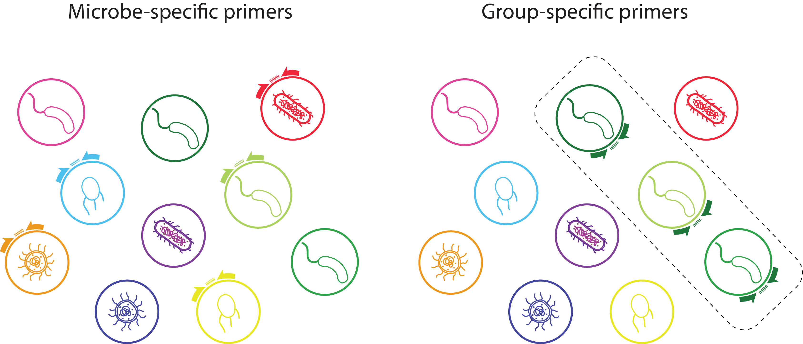
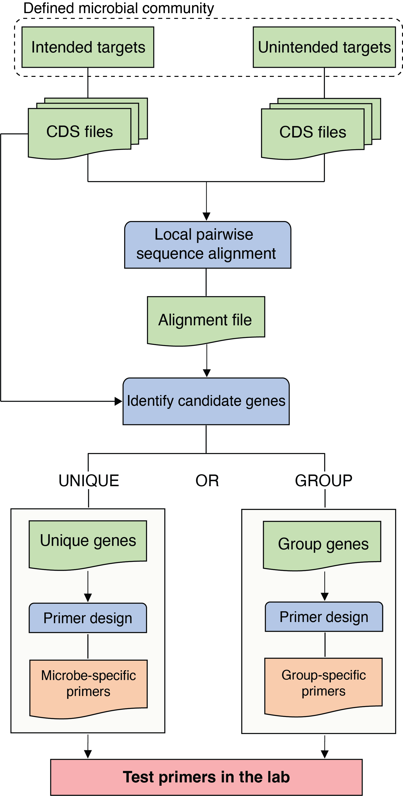

# Phylogenetically Unique Primers in python (PUPpy)

<p align="center">
  
</p>

PUPpy (<ins>**P**</ins>hylogenetically <ins>**U**</ins>nique <ins>**P**</ins>rimers in <ins>**py**</ins>thon) is a fully automated pipeline to design taxon-specific primers for any defined bacterial community. 

PUPpy can design both microbe-specific primers, which selectively amplify individual members of a community, and group-specific primers, which selectively amplify user-selected members. 

PUPpy-designed primers can be used to:
1) Detect microbes (e.g. with PCR),
2) Quantify substrain-level absolute microbial abundance (qPCR/ddPCR), and
3) Any other primer uses 

<p align="center">
  
</p>


# Table of contents
- [Installation](#installation)
	- [Install with bioconda](#install-with-bioconda)
	- [Dependencies](#Dependencies)
- [Important: before you start](#important-before-you-start)
- [How it works](#how-it-works)
- [Usage](#usage)
- [Command line options](#command-line-options)
- [Input](#input)
- [Output](#output)
- [Contributors](#contributors)
- [Citation](#citation)
- [License](#license)


# Installation

**PUPpy is currently ONLY available for MacOS and Linux**

## Install with bioconda

PUPpy can be installed for Mac on osx-64 systems using the commands below:

```sh
conda deactivate
conda create -n PUPpy -c hghezzi puppy
conda activate puppy
```
PUPpy will soon also be available through Conda on Linux, but for the moment please follow the instructions below.

## Dependencies

You can set up the conda environment to run PUPpy using the YAML definition found in this repository:

```sh
# Clone PUPpy GitHub directory
git clone https://github.com/Tropini-lab/PUPpy.git

# Change directory
cd PUPpy

# Create and set up conda environment
conda deactivate
conda env create -f PUPpy_environment.yml
conda activate PUPpy
```

Or by manually installing dependencies:

- [MMseqs2](https://github.com/soedinglab/MMseqs2)
- [Pandas](https://github.com/pandas-dev/pandas) >=1.5
- [BioPython](https://github.com/biopython/biopython)
- [Dask](https://github.com/dask/dask)
- [r-tidyverse](https://github.com/conda-forge/r-tidyverse-feedstock)
- [r-readr](https://github.com/tidyverse/readr)
- [r-stringi](https://github.com/gagolews/stringi)
- [primer3-py](https://libnano.github.io/primer3-py/quickstart.html#installation)
- [colorama](https://github.com/tartley/colorama)

```sh
# Create Conda environment
conda deactivate
conda create -n PUPpy python=3.10.6 pyarrow=14.0.1
conda activate PUPpy

# Install dependencies
conda install -y -c bioconda -c conda-forge -c anaconda -c r \
    mmseqs2 pandas=1.5 primer3-py \
    biopython dask \
    colorama \
    r-stringi r-tidyverse r-readr
```

# Important: before you start

1) **PUPpy was developed to design taxon-specific primers in DEFINED bacterial communities.** 

   While in limiting cases it may be possible to use PUPpy-designed primers in undefined communities, specificity cannot be ensured *in silico* with PUPpy.
  
2) **Primers should always be tested *in vitro* prior to use.**
   
   PCR can be misterious, and while primers may look perfect *in silico*, we strongly encourage confirming their specifity *in vitro* prior to use.

# How it works

PUPpy takes any number of bacterial CDS files as input. Input CDS files are aligned against each other using [MMseqs2](https://github.com/soedinglab/MMseqs2) and then parsed to identify candidate unique or group-specific genes within the defined bacterial community provided by the user. Taxon-specific primers are then designed using [Primer3](https://primer3.org/manual.html) and provided as output in a tsv file.

<p align="center">
  
</p>


# Usage

**IMPORTANT:** If installing by cloning the GitHub directory, make sure you are in the **scripts** directory any time you are running PUPpy scripts or it won't work.

```
cd ./PUPpy/scripts
```

PUPpy operates in 2 main steps: 

1) ```puppy-align``` - performs local pairwise sequence alignment of all the input genes against each other, and 
2) ```puppy-primers``` - designs taxon-specific primers based on user-determined parameters.

Detailed usage information, including all the primer design parameters, can be seen by running ```-h``` or ```--help``` at each step.
```
puppy-align -h
puppy-primers -h
```

### 1. Genes alignment
The alignment step must always be run first for any **new** defined bacterial community. 

```python
puppy-align -in <PATH>/test/intended_input -un <PATH>/test/unintended_input -o <PATH>/test/alignment_output
```

This command creates the output file ```<PATH>/test/alignment_output/ResultDB.tsv``` which can be used as input for the primer design command (step 2). The command `puppy-primers` can be run as many times as desired without having to rerun `puppy-align` again, as long as the bacterial community remains unchanged.

### 2. Primer design

The second step consists in designing taxon-specific primers unique to individual members or shared by groups in the bacterial community.

```
puppy-primers -in <PATH>/test/intended_input -i <PATH>/test/alignment_output/ResultDB.tsv -o <PATH>/test/unique_output
```

By default, ```puppy-primers``` outputs **unique** primers. To design **group** primers, add the argument ```-p group``` to the code above.

```puppy-primers``` **requires** 2 arguments as input:
- ```-in``` or ```--intended``` - the same folder as `puppy-align`, containing the CDS files of the organisms for which you want to design taxon-specific primers. 

- ```-i``` or ```--input``` - either the alignment file, ```ResultDB.tsv``` or ```UniqueGenesList.tsv``` 

	- ```UniqueGenesList.tsv``` is a file created by running ```puppy-primers``` on **unique** mode, containing the list of unique genes found for the organisms listed in ```--target_species```. 
	- This is a shortcut if you need to run ```puppy-primers``` multiple times on the same community and it provides the same output as using ```ResultDB.tsv```. The only difference is that you can only use ```UniqueGenesList.tsv``` after having run ```puppy-primers``` at least once before, while ```ResultDB.tsv``` must be used immediately after ```puppy-align```.

You can see the default primer design parameters used by Primer3 by running ```puppy-primers -h```.

## Command line options
Command line options for **```puppy-align```**
```
General:
  --help			This help
  --intended [X]		Directory with the CDS files of the intended targets in the defined microbial community, for which primers should be designed (default '')
  --unintended [X]		Directory with CDS files of unintended targets in the defined microbial community, for specificity checks (default '')
  --outdir [X]			Output directory (default 'Align_OUT')
  --identity [X]		Identity thresholds to report sequence alignments by MMseqs2 (default '0.3')
```

Command line options for **```puppy-primers```**
```
General:
  --help			This help
  --primers_type [X]		Design unique or shared primers among the target bacterial group (default 'unique')
  --intended [X]		Directory containing the CDS files for the species to design taxon-specific primers (default '')
  --input [X]			Input file to generate primers. Either 'ResultDB.tsv' OR 'UniqueGenesList.tsv' file must be provided (default '')
  --outdir [X]			Relative path to the output folder (default 'Primer3_output')
Primer3 parameters:
  --genes_number [X]		Number of genes per species to design primers (default '5')
  --primers_number [X]		Number of primer pairs to design for each gene (default '4')
  --optimal_primer_size [X]	Primer optimal size (default '20')
  --min_primer_size [X]		Primer minimum size (default '18')
  --max_primer_size [X]		Primer maximum size (default '22')
  --optimal_primer_Tm [X]	Primer optimal melting temperature (default '60.0')
  --min_primer_Tm [X]		Primer minimum melting temperature (default '58.0')
  --max_primer_Tm [X]		Primer maximum melting temperature (default '63.0')
  --max_Tm_diff [X]		Maximum Tm difference between the primer pair (default '2.0')
  --min_primer_gc [X]		Primer minimum GC content (default '40.0')
  --max_primer_gc [X]		Primer maximum GC content (default '60.0')
  --product_size_range [X]	Product size range (default '75 150')
  --max_poly_x [X]		Maximum poly X allowed (default '3')
  --GC_clamp [X]		Primer GC clamp (default '1')
```

## Input

Currently, PUPpy supports CDS files generated from any of these 3 approaches: [prokka](https://github.com/tseemann/prokka), [RAST](https://rast.nmpdr.org/) and/or downloaded from the [NCBI](https://www.ncbi.nlm.nih.gov/assembly). This is necessary because PUPpy only recognises FASTA headers formats from these 3 programs.

- For Prokka, rename the ```.ffn``` output file to end with the extension ```.fna```

Examples of accepted FASTA headers are shown here:
```
# CDS file downloaded from the NCBI:
>lcl|NC_004663.1_cds_WP_011107050.1_1 [locus_tag=BT_RS00005] [db_xref=GeneID:1075082] [protein=hypothetical protein] [protein_id=WP_011107050.1] [location=93..710] [gbkey=CDS]

# CDS file from prokka:
>COAIMFFE_00001 putative protein

# CDS file from RAST:
>fig|6666666.855680.peg.1
```

Moreover, input CDS filenames must meet the following 3 requirements to be used by PUPpy:

1) Filename must **start** with a unique identifier that allows you to distinguish organisms in the defined community.

	- e.g. ```Bacteroides_theta_VPI5482```

2) Filename must **contain** the string cds.

	- e.g. ```cds```, ```cds_from_genomic```, ```cds_genomic``` etc...

3) Filename must **end** with the extension ```.fna```
   
   	- e.g. ```cds.fna```, ```cds_from_genomic.fna```, ```cds_genomic.fna```, etc...


Examples of accepted CDS filenames:
- ```B_theta_VPI5482_cds.fna```
- ```Bacteroides_thetaiotaomicron_VPI_5482_cds_from_genomic.fna```

## Output

The key output of ```puppy-align``` is the file ```ResultDB.tsv```, which stores exhaustive information about all the local pairwise alignments. To see an example of this output file, go to: ```./test/alignment_output/ResultDB.tsv``` in this repository. 

The outputs of ```puppy-primers``` vary depending on which mode is run:

**Unique** mode:
- ```Stats_pipelineOutput.tsv``` - table containing the number of unique genes found and total number of genes for each community member.
- ```UniqueGenesPlot.pdf``` - barplot showing the number of unique genes found for each community member.
- ```UniqueGenesList.tsv``` - list of unique genes found for each member
- **```UniquePrimerTable.tsv```** - output table with the taxon-specific primers designed and their respective parameters
- ```primer3_files/``` - folder containing the individual primer3 outputs of the primers in ```UniquePrimerTable.tsv```

Examples of these outputs can be seen in this repository at ```./test/unique_output/```

**Group** mode:
- **```GroupPrimerTable.tsv```** - output table with the taxon-specific primers designed and their respective parameters
- ```primer3_files/``` - folder containing the individual primer3 outputs of the primers in ```GroupPrimerTable.tsv```
- ```IdealGroupGenes.tsv``` - List of most ideal candidate genes used by PUPpy to design group-specific primers. Ideal genes must meet the following requirements:

	- The candidate gene has exactly 1 alignment to each intended target;
	- The candidate gene only amplifies intended species in the defined community;
	- The candidate gene aligns perfectly (100% ID) to each target gene;
	- The entire length of the candidate gene (i.e. 100% query coverage) aligns to each target gene;
	- The candidate gene aligns to the entire sequence of each target gene (i.e. 100% target coverage).

- ```SecondChoiceGroupGenes.tsv``` - List of not-ideal genes that will be used by PUPpy to design group-specific primers only if no ideal genes are found. "Second choice" genes must meet the following requirements:

	- The candidate gene has more than 1 alignment to at least one intended target;
	- The candidate gene only amplifies intended species in the defined community;
	- The candidate gene does not align perfectly to at least one target gene;
	- Only a portion of the candidate gene (i.e. <100% query coverage) aligns to at least one target gene;
	- The candidate gene aligns does not align to the entire sequence of at least one target gene.

- ```UndesiredGroupGenes.tsv``` - List of genes that will not be considered by PUPpy, as they would not yield group-specific primers. Undesired genes must meet the following requirements:

	- The candidate gene has more than 1 alignment to at least one intended target and it does not amplify all targets OR it does not amplify any intended targets;
	- The candidate gene amplifies unintended species in the defined community;
	- The candidate gene not align perfectly to at least one target gene;
	- Only a portion of the candidate gene (i.e. <100% query coverage) aligns to at least one target gene;
	- The candidate gene aligns does not align to the entire sequence of at least one target gene.

Examples of these outputs can be seen in this repository at ```./test/group_output/```

## Contributors

- Hans Ghezzi
- Katharine Michelle Ng
- Juan Camilo Burckhardt
- Yiyun Michelle Fan

## Citation

If you use PUPpy in your research, please cite the original paper:

## License

PUPpy is made available under GPLv3. See LICENSE for details. Copyright Carolina Tropini.

Developed by Hans Ghezzi at the University of British Columbia (UBC).
