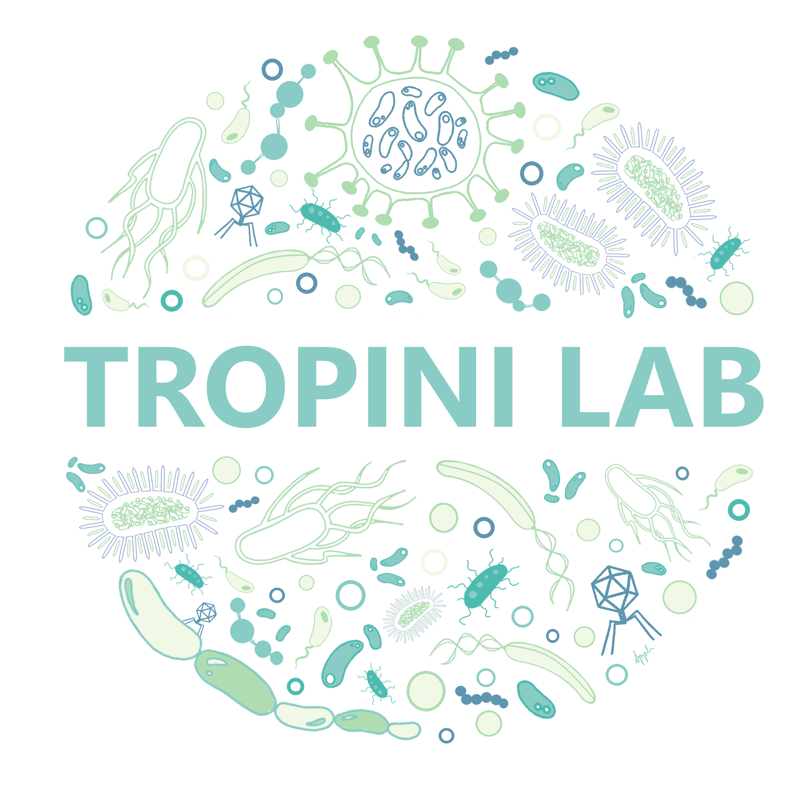

#  PUPpy - A pipeline to design taxon-specific primers for any defined bacterial community.


- [PUPpy](#PUPpy)
	- [Installation](#installation)
		- [Install through the bioconda package](#install-through-the-bioconda-package)
		- [Pre-compiled binary](#pre-compiled-binary)
		- [Compiling from source](#compiling-from-source)
		- [Development version](#development-version)
		- [Dependencies](#dependencies)
		- [Shell completion](#shell-completion)
	- [Usage](#usage)
	- [Input](#input)
	- [Contributors](#contributors)
	- [Citation](#citation)
	- [License](#license)


# PUPpy

PUPpy (<ins>**P**</ins>hylogenetically <ins>**U**</ins>nique <ins>**P**</ins>rimers in <ins>**py**</ins>thon) is a computational pipeline developed to design taxon-specific primers within a defined bacterial community. PUPpy can design both strain-specific primers, which selectively amplify each member of the community, and group-specific primers, which selectively amplify user-selected members. Primers designed with the pipeline can be used to assess the presence/absence of bacteria in samples through PCR, as well as quantify their abundance via qPCR. 

# Overview

PUPpy takes any number of bacterial CDS files as input. CDS files must be generated from one of these 3 programs: Prokka, RAST or downloaded from the NCBI. Input CDS files are aligned using [MMseqs2](https://github.com/soedinglab/MMseqs2) and then parsed to identify candidate unique or group-specific genes within the defined bacterial community provided by the user. Taxon-specific primers are then designed using [Primer3](https://primer3.org/manual.html) and provided as output in an Excel file.

# IMPORTANT:

1) **PUPpy was developed to design taxon-specific primers in a DEFINED bacterial community.** 

   While in limiting cases it may be possible to use these primers in undefined communities, this cannot be ensured through this pipeline
  
2) **Primers should always be tested *in vitro* prior to use.**
   
   PCR can be a mistery, and while primers may look perfect *in silico*, we strongly encourage testing their specifity *in vitro* prior to use.

# Installation

### Install with bioconda

PUPpy and its dependencies can be installed with conda and used on Mac and Linux.

```sh 
conda install puppy
```

Installing thorugh conda ensures that all the scripts from the PUPpy distribution are available on ```$PATH```

### Dependencies

You can also set up the conda environment to run PUPpy using the YAML definition found in this repository:

```sh
# Clone PUPpy GitHub directory
git clone https://github.com/Tropini-lab/PUPpy_pipeline.git

# Change directory
cd PUPpy_pipeline

# Create and set up conda environment
conda deactivate
conda env create -n puppy -f PUPpy_environment.yml
conda activate PUPpy
```

Or by manually installing dependencies:

- [MMseqs2](https://github.com/soedinglab/MMseqs2)
- [Pandas](https://github.com/pandas-dev/pandas) >=1.5
- [BioPython](https://github.com/biopython/biopython)
- [Dask](https://github.com/dask/dask)
- [r-tidyverse](https://github.com/conda-forge/r-tidyverse-feedstock)
- [r-readr](https://github.com/tidyverse/readr)
- [r-stringi](https://github.com/gagolews/stringi)
- [primer3-py](https://libnano.github.io/primer3-py/quickstart.html#installation)
- [colorama](https://github.com/tartley/colorama)


# Simple usage

PUPpy consists of 2 main steps: 1) aligning the input genes and 2) designing taxon-specific primers.

The alignment step must always be run for any new defined bacterial community:

```python
puppy-align -c test/input -o test/alignment_output
```

The second step is where users choose whether to design taxon-specific primers unique to individual members or shared by groups of the bacterial community.
This step can be run multiple times changing the target species, or primer-design parameters, while keeping the same input)alignments.tsv generated in step 1.

```python
puppy-primers -t test/input -i test/alignment_output/ResultDB.tsv -o test/unique_output
```
## Input

Currently, PUPpy supports CDS files generated from any of these 3 approaches: [PROKKA](https://github.com/tseemann/prokka), [RAST](https://rast.nmpdr.org/) and/or [NCBI](https://www.ncbi.nlm.nih.gov/assembly).

## License

PUPpy is made available under GPLv3. See LICENSE for details. Copyright Carolina Tropini.

Developed by Hans Ghezzi at University of British Columbia (UBC).
