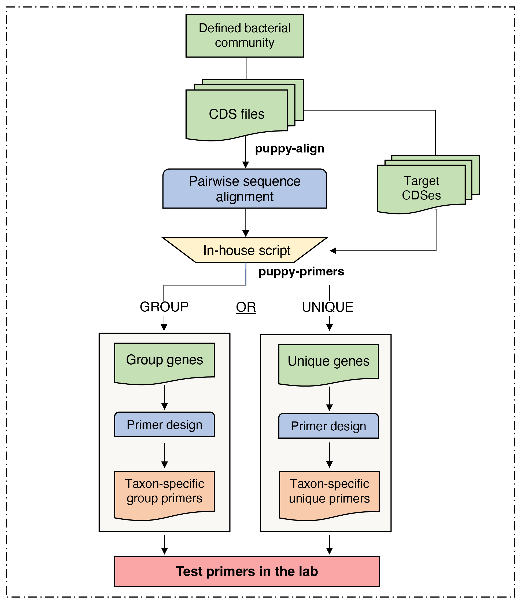

# Phylogenetically Unique Primers in python (PUPpy)

PUPpy (<ins>**P**</ins>hylogenetically <ins>**U**</ins>nique <ins>**P**</ins>rimers in <ins>**py**</ins>thon) is an automated pipeline to design taxon-specific primers for any defined bacterial community. 

PUPpy can design both strain-specific primers, which selectively amplify each member of the community, and group-specific primers, which selectively amplify user-selected members. 

Primers designed with the pipeline can be used to assess the presence/absence of bacteria in samples through PCR, as well as quantify their abundance via qPCR, among other uses. 

# Table of contents
- [Installation](#installation)
	- [Install with bioconda](#install-with-bioconda)
	- [Dependencies](#Dependencies)
- [Important: before you start](#important-before-you-start)
- [How it works](#how-it-works)
- [Usage](#usage)
- [Input](#input)
- [Contributors](#contributors)
- [Citation](#citation)
- [License](#license)


# Installation

## Install with bioconda

PUPpy and its dependencies can be installed with conda and used on Mac and Linux.

```sh 
conda install -c bioconda puppy
```

Installing thorugh conda ensures that all the scripts from the PUPpy distribution are available on ```$PATH```

## Dependencies

You can also set up the conda environment to run PUPpy using the YAML definition found in this repository:

```sh
# Clone PUPpy GitHub directory
git clone https://github.com/Tropini-lab/PUPpy_pipeline.git

# Change directory
cd PUPpy_pipeline

# Create and set up conda environment
conda deactivate
conda env create -n puppy -f PUPpy_environment.yml
conda activate PUPpy
```

Or by manually installing dependencies:

- [MMseqs2](https://github.com/soedinglab/MMseqs2)
- [Pandas](https://github.com/pandas-dev/pandas) >=1.5
- [BioPython](https://github.com/biopython/biopython)
- [Dask](https://github.com/dask/dask)
- [r-tidyverse](https://github.com/conda-forge/r-tidyverse-feedstock)
- [r-readr](https://github.com/tidyverse/readr)
- [r-stringi](https://github.com/gagolews/stringi)
- [primer3-py](https://libnano.github.io/primer3-py/quickstart.html#installation)
- [colorama](https://github.com/tartley/colorama)

# Important: before you start

1) **PUPpy was developed to design taxon-specific primers in DEFINED bacterial communities.** 

   While in limiting cases it may be possible to use PUPpy-designed primers in undefined communities, specificity cannot be ensured *in silico* with PUPpy.
  
2) **Primers should always be tested *in vitro* prior to use.**
   
   PCR can be misterious, and while primers may look perfect *in silico*, we strongly encourage confirming their specifity *in vitro* prior to use.

# How it works

PUPpy takes any number of bacterial CDS files as input. Input CDS files are aligned against each other using [MMseqs2](https://github.com/soedinglab/MMseqs2) and then parsed to identify candidate unique or group-specific genes within the defined bacterial community provided by the user. Taxon-specific primers are then designed using [Primer3](https://primer3.org/manual.html) and provided as output in an Excel file.

  


# Usage

PUPpy operates in 2 main steps: 

1) ```puppy-align``` - performs local pairwise alignment of all the input CDS genes against each other, and 
2) ```puppy-primers``` - designs taxon-specific primers based on user-determined parameters.

Detailed usage information, including all the primer design parameters, can be seen by running ```-h``` or ```--help``` at each step.

### 1. Genes alignment
The alignment step must always be run first for any **new** defined bacterial community:

```python
puppy-align -c test/input -o test/alignment_output
```

This command creates an output file, ```test/alignment_output/ResultDB.tsv``` which can be used as input for the primer design command (step 2).

### 2. Primer design

The second step consists in designing taxon-specific primers unique to individual members or shared by groups of the bacterial community.

```
puppy-primers -t test/input -i test/alignment_output/ResultDB.tsv -o test/unique_output
```

By default, ```puppy-primers``` outputs **unique** primers. To design **group** primers, add the argument ```-p group``` to the code above.

```puppy-primers``` **requires** 2 arguments as input:
- ```-t``` or ```--target_species``` - a folder containing the CDS files of the organisms for which you want to design taxon-specific primers. 

	- This can either be the same directory used as argument of ```-c``` in ```puppy-align```, or a subset of the ladder.
- ```-i``` or ```--input``` - either the alignment file, ```ResultDB.tsv``` or ```final_genes.tsv``` 

	- ```final_genes.tsv``` is a file created by running ```puppy-primers``` on **unique** mode, containing the list of unique genes found for the organisms listed in ```--target_species```. 
	- This is a shortcut if you need to run ```puppy-primers``` multiple times on the same community and it provides the same output as using ```ResultDB.tsv```. The only difference is that you can only use ```final_genes.tsv``` after having run ```puppy-primers``` at least once before, while ```ResultDB.tsv``` can be used straight after ```puppy-align```.

You can see the default primer design parameters used by Primer3 by running ```puppy-primers -h```.

While we recommend **not to** run ```puppy-align``` more than once on the same defined community, ```puppy-primers``` can be run multiple times, for example to create primer pairs with different parameters.

## Input

Currently, PUPpy supports CDS files generated from any of these 3 approaches: [prokka](https://github.com/tseemann/prokka), [RAST](https://rast.nmpdr.org/) and/or downloaded from the [NCBI](https://www.ncbi.nlm.nih.gov/assembly). This is important because PUPpy will only recognise FASTA headers from these 3 programs.

Example of accepted FASTA headers are shown here:
```
# CDS file downloaded from the NCBI
>lcl|NC_004663.1_cds_WP_011107050.1_1 [locus_tag=BT_RS00005] [db_xref=GeneID:1075082] [protein=hypothetical protein] [protein_id=WP_011107050.1] [location=93..710] [gbkey=CDS]

# CDS file from prokka
>COAIMFFE_00001 putative protein

# CDS file from RAST
>fig|6666666.855680.peg.1
```

Moreover, input CDS filenames must meet the following 3 requirements to be used by PUPpy:

1) Filename must start with a unique identifier that allows you to distinguish organisms.

	- e.g. ```Bacteroides_theta_VPI5482```

2) Filename must contain the string cds.

	- e.g. ```cds```, ```cds_from_genomic``` or ```cds_genomic```

3) Filename must end with the extension ```.fna```

Examples of accepted CDS filenames:
- ```B_theta_VPI5482_cds.fna```
- ```Bacteroides_thetaiotaomicron_VPI_5482_cds_from_genomic.fna```

## Output

The key output of ```puppy-align``` is the file ```ResultDB.tsv```, which stores exhaustive information about all the local pairwise alignments. To see an example of this output file, go to: ```./test/alignment_output/ResultDB.tsv``` in this repository. 

The outputs of ```puppy-primers``` vary depending on which mode is run:

**Unique** mode:
- ```Stats_pipelineOutput.tsv``` - table containing the number of unique genes found and total number of genes for each community member.
- ```UniqueGenesPlot.pdf``` - barplot showing the number of unique genes found for each community member.
- ```final_genes.tsv``` - list of unique genes found for each member
- **```UniquePrimerTable.tsv```** - output table with the taxon-specific primers designed and their respective parameters
- ```primer3_files/``` - folder containing the individual primer3 outputs of the primers in ```UniquePrimerTable.tsv```

Examples of these outputs can be seen in this repository at ```./test/unique_output/```


## Contributors

- Juan Camilo Burckhardt

## Citation

If you use PUPpy in your research, please cite the original paper:

## License

PUPpy is made available under GPLv3. See LICENSE for details. Copyright Carolina Tropini.

Developed by Hans Ghezzi at University of British Columbia (UBC).


## EXTRAS

CDS files must be generated from one of these 3 programs: Prokka, RAST or downloaded from the NCBI. 
