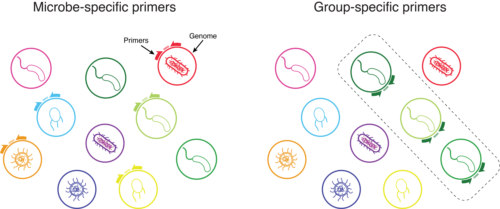
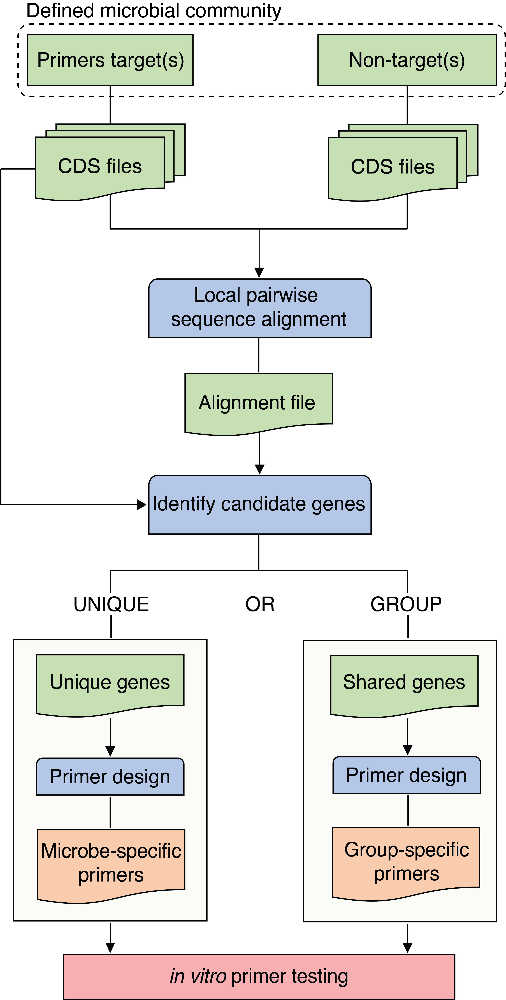

# Phylogenetically Unique Primers in python (PUPpy)

<p align="center">
  
</p>

PUPpy (**P**hylogenetically **U**nique **P**rimers in **py**thon) is a fully automated pipeline to design taxon-specific primers for any defined bacterial community.

PUPpy can design both microbe-specific primers, which selectively amplify individual members of a community, and group-specific primers, which selectively amplify user-selected members.

PUPpy-designed primers can be used to:

1) Detect microbes (e.g. with PCR),
2) Quantify substrain-level absolute microbial abundance (qPCR/ddPCR), and
3) Any other primer uses

<p align="center">
  
</p>

# Table of contents

- [Phylogenetically Unique Primers in python (PUPpy)](#phylogenetically-unique-primers-in-python-puppy)
- [Table of contents](#table-of-contents)
- [Installation](#installation)
  - [Install with conda (x86-64 \& linux-64)](#install-with-conda-x86-64--linux-64)
  - [Install with conda (Windows)](#install-with-conda-Windows)
  - [Exported environment (x86-64 \& linux-64)](#exported-environment-x86-64--linux-64)
- [Important: before you start](#important-before-you-start)
- [How it works](#how-it-works)
- [Usage](#usage)
  - [Command-line execution](#Command-line-execution)
    - [1. Genes alignment (puppy-align)](#1-genes-alignment-puppy-align)
    - [2. Primer design (puppy-primers)](#2-primer-design-puppy-primers)
  - [GUI execution](#GUI-execution)
  - [PUPpy parameters](#PUPpy-parameters)
- [Input](#input)
- [Output](#output)
- [Contributors](#contributors)
- [Citation](#citation)
- [License](#license)

# Installation

**PUPpy is currently ONLY available for MacOS and Linux. Windows user can still execute PUPpy with a Windows Subsystem for Linux (WSL) such as Ubuntu**

**Installing PUPpy currently REQUIRES 1) [Conda](https://docs.conda.io/projects/miniconda/en/latest/) AND 2) pip**. Make sure both are installed prior to following the installation instructions below.

Installation of the puppy package varies depending on the architecture of your computer. To check what you have, open your terminal app and run: ``uname -m``. The architectures currently supported are:

1) x86-64 (Mac Intel chips, or emulated)
2) linux-64

We are currently working on making puppy also available on arm64 (Mac M1/M2 chips). For more information on how M1/M2 users can emulate the osx-64 architecture (and thus install puppy) please see the links below:

- https://stackoverflow.com/questions/71515117/how-to-set-up-a-conda-osx-64-environment-on-arm-mac
- https://taylorreiter.github.io/2022-04-05-Managing-multiple-architecture-specific-installations-of-conda-on-apple-M1/

## Install with conda (x86-64 & linux-64)

Ensure that the conda-forge and bioconda channels are added prior to installation:

```sh
conda config --add channels defaults
conda config --add channels conda-forge
conda config --add channels bioconda
```

You can now create a new environment and install the puppy package:

```sh
conda create -n puppy -c hghezzi -y puppy
```

Activate your environment prior to use:

```sh
conda activate puppy
```

## Install with conda (Windows). 

Windows users must install a Windows Subsystem for Linux, such as [Ubuntu](https://canonical-ubuntu-wsl.readthedocs-hosted.com/en/latest/), and can then follow the same instructions above to install PUPpy.

## Exported environment (x86-64 & linux-64)

You can set up the conda environment to run PUPpy using the YAML definition found in this repository:

```sh
# Clone PUPpy GitHub directory
git clone https://github.com/Tropini-lab/PUPpy.git

# Change directory
cd PUPpy

# Create and set up conda environment
conda deactivate
conda env create -f puppy_env.yml
conda activate puppy
```

Lastly, change the permissions to be able to execute the PUPpy scripts:

```
chmod +x ./scripts/*
```

# Important: before you start

1) **PUPpy was developed to design taxon-specific primers in DEFINED bacterial communities.**

   While in limiting cases it may be possible to use PUPpy-designed primers in undefined communities, specificity cannot be ensured *in silico* with PUPpy.
2) **Primers should always be tested *in vitro* prior to use.**

   PCR can be misterious, and while primers may look perfect *in silico*, we strongly encourage confirming their specifity *in vitro* prior to use.

3) **Read the "INPUT" section below to ensure cds files are named correclty prior to use**

# How it works

PUPpy takes any number of bacterial CDS files as input. Input CDS files are aligned against each other using [MMseqs2](https://github.com/soedinglab/MMseqs2) and then parsed to identify candidate unique or group-specific genes within the defined bacterial community provided by the user. Taxon-specific primers are then designed using [Primer3](https://primer3.org/manual.html) and provided as output in a tsv file.

<p align="center">
  
</p>

# Usage

**Always activate your conda environment before running PUPpy.**

```sh
conda activate puppy
```
**Check that you are using the most recent PUPpy version and update if needed**

```sh
conda list puppy # Check version
conda update puppy # Update puppy package
```

PUPpy operates in 2 main steps:

1) ``puppy-align`` - performs local pairwise sequence alignment of all the input genes against each other, and
2) ``puppy-primers`` - designs taxon-specific primers based on user-determined parameters.

**IMPORTANT:** The syntax to run PUPpy varies depending on the installation mode.

If installed with **conda**, you do not need to specify the path to the scripts. For example:

```sh
puppy-align -h
```

If installed with the **exported environment**, you must always specify the exact path when running scripts. For example:

```sh
./scripts/puppy-align -h
```

PUPpy can be executed either from **command-line** OR from a **graphical user interface (GUI)**

## Command-line execution

Detailed usage information, including all the primer design parameters, can be seen by running ``-h`` or ``--help`` at each step.

```
puppy-align -h
puppy-primers -h
```

Remember to specify the **path** to the script if you installed PUPpy from the exported environment! 

### 1. Gene alignment (puppy-align)

The alignment step must always be run first for any **new** defined bacterial community.

```
puppy-align -pr <PATH>/test/INPUT_primerTarget -nt <PATH>/test/INPUT_nonTarget -o <PATH>/test/OUTPUT_puppy-align
```

This command creates the output file ``<PATH>/test/OUTPUT_puppy-align/ResultDB.tsv`` which can be used as input for the primer design command (step 2). The command `puppy-primers` can be run as many times as desired without having to rerun `puppy-align` again, as long as the bacterial community remains unchanged.

### 2. Primer design (puppy-primers)

The second step consists in designing taxon-specific primers unique to individual members or shared by groups in the bacterial community.

``puppy-primers`` **requires** 2 arguments as input:

- ``-pr`` or ``--PRIMERTARGET``: the same folder as `puppy-align`, containing the CDS files of the organisms for which you want to design taxon-specific primers.
- ``-i`` or ``--input``: either the alignment file, ``ResultDB.tsv`` or ``UniqueGenesList.tsv``

  - ``UniqueGenesList.tsv`` is a file created by running ``puppy-primers`` on **unique** mode, containing the list of unique genes found for the organisms listed in ``--target_species``.
  - This is a shortcut if you need to run ``puppy-primers`` multiple times on the same community and it provides the same output as using ``ResultDB.tsv``. The only difference is that you can only use ``UniqueGenesList.tsv`` after having run ``puppy-primers`` at least once before, while ``ResultDB.tsv`` must be used immediately after ``puppy-align``.
 
By default, ``puppy-primers`` outputs **unique** primers for each member in the `INPUT_primerTarget` folder. 

```
puppy-primers -pr <PATH>/test/INPUT_primerTarget -i <PATH>/test/OUTPUT_puppy-align/ResultDB.tsv -o <PATH>/test/OUTPUT_puppy-primers_unique
```

Alternatively, it is possible to design **group** primers by adding the argument ``-p group`` to the code above. This will instruct PUPpy to design primer pairs that amplify all members in the `INPUT_primerTarget` folder.

```
puppy-primers -p group -pr <PATH>/test/INPUT_primerTarget -i <PATH>/test/OUTPUT_puppy-align/ResultDB.tsv -o <PATH>/test/OUTPUT_puppy-primers_group
```

## GUI execution
Alternatively, you can execution both scripts from a graphical user interface (GUI). The GUI is not available on computing clusters and can be started with the following command:

```
puppy-GUI
```
Remember to run ```<PATH>/puppy-GUI``` if you installed PUPpy from the exported environment. 

The GUI also consists of 2 parts, as shown below:

<p align="center">
  
</p>

- The left half must be run first, as it executes the `puppy-align` script with modifiable parameters.
  - The field "puppy-align script folder" automatically populates with the location of the installed puppy scripts. Required to run `puppy-align` and `puppy-primers` from the GUI.
  - Alignment stringency parameters can be modified by clicking on the expandable "Alignment Stringency Parameters" button.
- The right half can be run second and it executes the `puppy-primers` script.
  - Input fields are automatically populated after running `puppy-align`, but you can change them based on your needs.
  - Primer design parameters can be modified by clicking on the expandable "Primer Design Parameters" button.
- Both scripts can be executed by clicking on the "Run" button and the help functions are available by clicking on the "Help" buttons.

All command-line parameters are also available in the GUI.

**Usage Tip**: If you find the GUI to be laggy, I find that highlight the fields/parameters to change helped speed it up.

## PUPpy parameters

Parameters for **``puppy-align``**

```
usage: puppy-align [-h] -pr PRIMERTARGET [-nt NONTARGET] [-o OUTDIR] [-id IDENTITY] [-mal MIN_ALN_LEN] [-c COVERAGE] [--covMode COVMODE] [-v]

Options:
  -pr, --primerTarget  Directory with the CDS files of the targets in the defined microbial community, for which primers should be designed. Required.
  -nt, --nonTarget     Directory with CDS files of non-targets in the defined microbial community, for specificity checks.
  -o, --outdir         Relative path to the output folder. Default: Align_OUT.
  -v, --version        Show the version of the script and exit.

Alignment options (adjust with caution):
  -id, --identity      Minimum percentage identity to report sequence alignments (-id [0.0,1.0]). Default: 0.0.
  -mal, --min_aln_len  Minimum alignment length to report sequence alignments. Default: 0.
  -c, --coverage       Minimum percentage coverage to report sequence alignments (-c [0.0,1.0]). Default: 0.0.
  --covMode            Coverage mode to report alignments during mmseqs search. Options:
                         0 = alignment covers at least -c [] of query and target,
                         1 = alignment covers at least -c [] of target,
                         2 = alignment covers at least -c [] of query,
                         3 = target is at least -c [] of query length.
                       See MMseqs2 manual for details. Default: 0.
```

Parameters for **``puppy-primers``**

```
usage: puppy-primers [-h] -pr PRIMERTARGET -i INPUT [-p {unique,group}] [-o OUTDIR] [-ng GENES_NUMBER] [-np PRIMERS_NUMBER] [-ops OPTIMAL_PRIMER_SIZE] [-mips MIN_PRIMER_SIZE]
            [-maps MAX_PRIMER_SIZE] [-optm OPTIMAL_PRIMER_TM] [-mitm MIN_PRIMER_TM] [-matm MAX_PRIMER_TM] [-tmd MAX_TM_DIFF] [-migc MIN_PRIMER_GC] [-magc MAX_PRIMER_GC]
            [-s PRODUCT_SIZE_RANGE] [-mpolyx MAX_POLY_X] [-GCc GC_CLAMP] [-v]
Options:
  -p, --primers_type           Type of primers to design ('unique' or 'group'). Default: 'unique'.
  -pr, --primerTarget          Directory containing CDS files for species to design taxon-specific primers. Required.
  -i, --input                  Input file (ResultDB.tsv) from `puppy-align` or UniqueGenesList.tsv. Required.
  -o, --outdir                 Output directory for primer design files. Default: 'Primer3_output'.
  -v, --version                Show the version of the script and exit.

Primer Design Parameters:
  -ng, --genes_number          Number of genes per species for primer design. Default: 5.
  -np, --primers_number        Number of primer pairs to design for each gene. Default: 4.
  -ops, --optimal_primer_size  Optimal size of primers. Default: 20.
  -mips, --min_primer_size     Minimum size of primers. Default: 18.
  -maps, --max_primer_size     Maximum size of primers. Default: 22.
  -optm, --optimal_primer_Tm   Optimal melting temperature (Tm) of primers. Default: 60.0.
  -mitm, --min_primer_Tm       Minimum Tm of primers. Default: 58.0.
  -matm, --max_primer_Tm       Maximum Tm of primers. Default: 63.0.
  -tmd, --max_Tm_diff          Maximum Tm difference between primer pairs. Default: 2.0.
  -migc, --min_primer_gc       Minimum GC content of primers. Default: 40.0.
  -magc, --max_primer_gc       Maximum GC content of primers. Default: 60.0.
  -s, --product_size_range     Range of desired product sizes (format: min-max). Default: '75-150'.
  -mpolyx, --max_poly_x        Maximum length of homopolymer runs in primers. Default: 3.
  -GCc, --GC_clamp             Number of G/C bases at the 3' end of primers. Default: 1.
```

# Input

**IMPORTANT: CDS files in your input folder are permanently modified during both ``puppy-align`` and ``puppy-primers`` execution. 
Always duplicate your input folder to keep an original copy of your files in case you need to re-run the scripts from scratch.**

Currently, PUPpy supports CDS files generated from any of these 3 approaches: [prokka](https://github.com/tseemann/prokka), [RAST](https://rast.nmpdr.org/) and/or downloaded from the [NCBI](https://www.ncbi.nlm.nih.gov/assembly). This is necessary because PUPpy only recognises FASTA headers formats from these 3 programs.

- For Prokka, rename the ``.ffn`` output file to end with the extension ``.fna``

Examples of accepted FASTA headers are shown here:

```
# CDS file downloaded from the NCBI:
>lcl|NC_004663.1_cds_WP_011107050.1_1 [locus_tag=BT_RS00005] [db_xref=GeneID:1075082] [protein=hypothetical protein] [protein_id=WP_011107050.1] [location=93..710] [gbkey=CDS]

# CDS file from prokka:
>COAIMFFE_00001 putative protein

# CDS file from RAST:
>fig|6666666.855680.peg.1
```

**Note: Currently, PUPpy does not support "." (dots) in CDS filenames except for the file extension.**

Moreover, input CDS filenames must meet the following 3 requirements to be used by PUPpy:

1) Filename must **start** with a unique identifier that allows you to distinguish organisms in the defined community.

   - e.g. ``Bacteroides_theta_VPI5482``
2) Filename must **contain** the string cds.

   - e.g. ``cds``, ``cds_from_genomic``, ``cds_genomic`` etc...
3) Filename must **end** with the extension ``.fna``

   - e.g. ``cds.fna``, ``cds_from_genomic.fna``, ``cds_genomic.fna``, etc...

Examples of accepted CDS filenames:

- ``B_theta_VPI5482_cds.fna``
- ``Bacteroides_thetaiotaomicron_VPI_5482_cds_from_genomic.fna``

# Output

The key output of ``puppy-align`` is the file ``ResultDB.tsv``, which stores exhaustive information about all the local pairwise alignments. To see an example of this output file, go to: ``test/OUTPUT_puppy-align/ResultDB.tsv`` in this repository.

The outputs of ``puppy-primers`` vary depending on which mode is run:

**Unique** mode:

- ``Stats_pipelineOutput.tsv`` - table containing the number of unique genes found and total number of genes for each community member.
- ``UniqueGenesPlot.pdf`` - barplot showing the number of unique genes found for each community member.
- ``UniqueGenesList.tsv`` - list of unique genes found for each member
- **``UniquePrimerTable.tsv``** - output table with the taxon-specific primers designed and their respective parameters
- ``primer3_files/`` - folder containing the individual primer3 outputs of the primers in ``UniquePrimerTable.tsv``

Examples of these outputs can be seen in this repository at ``OUTPUT_puppy-primers_unique``

**Group** mode:

- **``GroupPrimerTable.tsv``** - output table with the taxon-specific primers designed and their respective parameters
- ``primer3_files/`` - folder containing the individual primer3 outputs of the primers in ``GroupPrimerTable.tsv``
- ``IdealGroupGenes.tsv`` - List of most ideal candidate genes used by PUPpy to design group-specific primers. Ideal genes must meet the following requirements:

  - The candidate gene has exactly 1 alignment to each intended target;
  - The candidate gene only amplifies intended species in the defined community;
  - The candidate gene aligns perfectly (100% ID) to each target gene;
  - The entire length of the candidate gene (i.e. 100% query coverage) aligns to each target gene;
  - The candidate gene aligns to the entire sequence of each target gene (i.e. 100% target coverage).
- ``SecondChoiceGroupGenes.tsv`` - List of not-ideal genes that will be used by PUPpy to design group-specific primers only if no ideal genes are found. "Second choice" genes must meet the following requirements:

  - The candidate gene has more than 1 alignment to at least one intended target;
  - The candidate gene only amplifies intended species in the defined community;
  - The candidate gene does not align perfectly to at least one target gene;
  - Only a portion of the candidate gene (i.e. <100% query coverage) aligns to at least one target gene;
  - The candidate gene aligns does not align to the entire sequence of at least one target gene.
- ``UndesiredGroupGenes.tsv`` - List of genes that will not be considered by PUPpy, as they would not yield group-specific primers. Undesired genes must meet the following requirements:

  - The candidate gene has more than 1 alignment to at least one intended target and it does not amplify all targets OR it does not amplify any intended targets;
  - The candidate gene amplifies unintended species in the defined community;
  - The candidate gene not align perfectly to at least one target gene;
  - Only a portion of the candidate gene (i.e. <100% query coverage) aligns to at least one target gene;
  - The candidate gene aligns does not align to the entire sequence of at least one target gene.

Examples of these outputs can be seen in this repository at ``OUTPUT_puppy-primers_group``

## Contributors

- Hans Ghezzi
- Katharine Michelle Ng
- Juan Camilo Burckhardt
- Yiyun Michelle Fan

## Citation

If you use PUPpy in your research, please cite the original paper: https://www.biorxiv.org/content/10.1101/2023.12.18.572184v1

## License

PUPpy is made available under GPLv3. See LICENSE for details. Copyright Carolina Tropini.

Developed by Hans Ghezzi at the University of British Columbia (UBC).
